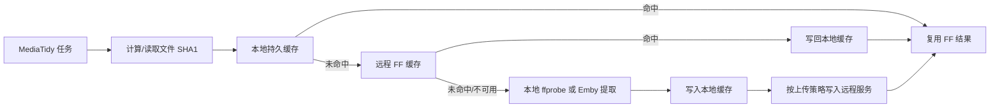

# FF 缓存服务

FF 缓存服务是 MediaTidy 的远程 FF 信息缓存中心，用来把高成本的媒体探测结果沉淀到 PostgreSQL，供多台 MediaTidy 节点复用。

它当前承载两类缓存：

| 缓存域 | 服务标识 | 保存内容 | 主要用途 |
|--------|----------|----------|----------|
| 整理 FF | `organize_ff` | `ffprobe` 解析结果、片源体积、扩展名、上传节点信息 | 自动整理、洗版评分、质量规则判断 |
| 神医 FF | `strm_assistant_ff` | Emby `MediaSource` / `MediaStreams` 相关 JSON、Item ID、MediaSource ID | STRM 神医缓存恢复、批量预热、整理后延迟采集 |

::: tip 适合什么时候部署
如果只有一台 MediaTidy、媒体库规模不大，本地 SHA1 缓存已经够用。远程 FF 缓存更适合多节点、重复整理/迁移、STRM 神医大规模预热，或者希望把一次探测结果共享给后续任务的场景。
:::

## 工作模型

MediaTidy 先尝试本地缓存，再按 SHA1 查询远程 FF 缓存；命中后直接恢复探测结果，跳过本地 `ffprobe` 或 Emby 媒体信息提取。未命中时继续本地探测，成功后可异步上传到远程服务。



服务端不会直接访问你的媒体文件，只保存客户端提交的结构化结果。缓存键使用文件 SHA1，因此同一文件即使路径不同，也可以复用同一份结果。

## MediaTidy 端配置

在「系统设置 → TMDB / 缓存」中配置远程 FF 缓存。新版配置分为两套：

| 配置块 | 字段 | 说明 |
|--------|------|------|
| 整理远程 FF 缓存 | `organizeRemoteFFCache` | 自动整理 FF 探测结果缓存 |
| 神医远程 FF 缓存 | `strmAssistantRemoteFFCache` | STRM 神医媒体源信息缓存 |

每套配置都包含以下字段：

| 字段 | 默认值 | 说明 |
|------|--------|------|
| `enabled` | `false` | 是否启用该缓存域 |
| `nodes` | `[]` | 远程服务节点列表，支持多节点 |
| `url` | — | 兼容旧版单节点地址；保存后会归一到节点列表 |
| `readStrategy` | `race` | 读取策略：`race`、`failover`、`shard` |
| `uploadStrategy` | `all` | 上传策略：`all`、`primary`、`shard` |
| `timeout` | `10000` | 单次请求超时，单位毫秒，范围 300–30000 |
| `upload` | `true` | 是否允许本节点把新结果上传到远程服务 |

多节点策略含义：

| 策略 | 适用位置 | 行为 |
|------|----------|------|
| `race` | 读取 | 并发查询所有启用节点，谁先命中用谁 |
| `failover` | 读取 | 按节点顺序查询，第一个命中即返回 |
| `shard` | 读取/上传 | 按 SHA1 分片选择节点，适合多节点分摊数据 |
| `all` | 上传 | 上传到所有启用节点 |
| `primary` | 上传 | 只上传到第一个启用节点 |

旧版 `remoteFFCacheEnabled`、`remoteFFCacheUrl`、`remoteFFCacheNodes` 等字段仍会被兼容读取；如果新版两套配置为空，旧配置会自动迁移到整理和神医两边。

## 服务端部署

生产环境推荐使用 `ff-cache-server` 目录中的 Docker Compose 包。服务由 Go 后端、PostgreSQL 和内置 Web 管理台组成，启动时会自动执行数据库迁移。

关键环境变量：

| 变量 | 默认值 | 说明 |
|------|--------|------|
| `PORT` | `9000` | FF 缓存服务端口 |
| `POSTGRES_HOST` | `localhost` / compose 中为 `postgres` | PostgreSQL 地址 |
| `POSTGRES_DB` | `ffcache` | 整理 FF 缓存数据库 |
| `STRM_ASSISTANT_POSTGRES_DB` | `ffcache_strm_assistant` | 神医 FF 缓存数据库 |
| `POSTGRES_PASSWORD` | — | PostgreSQL 密码，生产必须显式设置 |
| `FF_CACHE_ADMIN_USERNAME` | `admin` | 管理台用户名 |
| `FF_CACHE_ADMIN_PASSWORD` | `admin123` | 管理台密码，生产必须修改 |
| `FF_CACHE_SESSION_SECRET` | 内置默认值 | 管理台会话密钥，生产必须修改 |
| `FF_CACHE_ADMIN_ACCESS_KEY` | — | 管理台访问 key；设置后需通过 `/dashboard?key=...` 访问 |
| `FF_CACHE_ACCESS_MODE` | `authorization` | 客户端访问模式：`authorization` 或 `open` |
| `FF_CACHE_DATABASE_INIT_TIMEOUT_SECONDS` | `60` | 启动迁移/统计初始化超时，范围 10–3600 秒 |
| `TLS_CERT_FILE` / `TLS_KEY_FILE` | — | 直接启用 HTTPS；也可以放在反向代理后面 |

::: warning 生产安全
服务端 API 使用内置签名协议和 nonce 防重放，但生产环境仍建议放在 HTTPS 后面，并修改默认管理密码、会话密钥和访问 key。
:::

## 访问控制

`FF_CACHE_ACCESS_MODE` 决定服务端如何放行 MediaTidy 客户端：

| 模式 | 行为 | 适用场景 |
|------|------|----------|
| `authorization` | 需要签名通过，并且管理台已为邮箱和服务创建授权记录 | 多用户、公开节点、需要精细控制读写权限 |
| `open` | 签名通过即可使用；仍保留节点统计、节点封禁、试用期和读写开关 | 私有内网、信任环境、迁移旧服务 |

MediaTidy 会把授权描述中的邮箱作为授权邮箱上报。授权记录按 `email + service` 维度管理，同一个用户可以只开整理 FF、只开神医 FF，或两个服务都开。

授权记录还可以控制：

- 过期时间，空值表示永久有效
- 服务端是否允许该用户命中缓存
- 服务端是否接受该用户上传缓存

## 管理台

管理台入口为 `/dashboard`。如果设置了 `FF_CACHE_ADMIN_ACCESS_KEY`，入口是：

```text
https://your-ff-cache.example.com/dashboard?key=<access-key>
```

管理台可以完成：

- 查看整理 FF / 神医 FF 总量、命中、上传、最近访问
- 按 SHA1 前缀或来源信息搜索缓存
- 删除单条、清空缓存、重新统计表数量
- 管理客户端节点、封禁节点、控制节点命中/上传
- 管理授权记录
- 导入/导出 NDJSON
- 配置远程缓存同步源
- 配置 Telegram Bot，并查看节点、状态和排行榜

## 远程同步

多个 FF 缓存服务之间可以做增量同步。源端在管理台开启「远程同步」后生成专用 sync token；目标端添加同步源，选择同步域和 Cron 表达式。

同步接口只接受 sync token，不接受管理 token 或 Web 登录态。增量导出按 `(updated_at ASC, sha1 ASC)` 分页，默认每页 4000 行，最大 5000 行。

| 同步域 | 接口路径片段 | 说明 |
|--------|--------------|------|
| 整理 FF | `/api/sync/ff-cache/organize/...` | 同步 `ff_probe_cache` |
| 神医 FF | `/api/sync/ff-cache/strmAssistant/...` | 同步 `strm_assistant_ff_cache` |

大库首次同步建议在低峰期手动执行，之后再使用夜间 Cron，例如 `0 3 * * *`。

## STRM 神医缓存

神医 FF 缓存保存的是 Emby 返回的媒体源信息，不是 STRM 文件本身。典型流程是：

1. 神医任务按 Emby 范围读取媒体条目和媒体源。
2. 优先读取本地 sidecar JSON。
3. 本地无效或未命中时按 SHA1 查询远程神医缓存。
4. 远程命中后直接恢复媒体源信息。
5. 未命中时从 Emby 提取，必要时批量上传到远程服务。

整理后缓存池也会使用这套远程缓存：整理任务完成后把目标加入延迟队列，到期后再采集神医缓存，避免 Emby 刚刷新时媒体源还没有稳定。

## 故障排查

| 现象 | 重点检查 |
|------|----------|
| MediaTidy 测试远程 FF 失败 | 服务 URL 是否带协议、节点是否启用、超时是否过短 |
| 返回 `authorization not found` | 管理台是否为当前授权邮箱创建了对应服务授权 |
| 返回 `service mismatch` | 客户端请求服务与服务端授权服务不一致，检查整理/神医配置是否接到同一服务版本 |
| 有查询但没有上传 | MediaTidy 端 `upload=false`，或服务端授权/节点上传开关关闭 |
| 命中率低 | 文件缺少 SHA1、首次同步未完成、不同节点使用了 `shard` 但数据未按相同策略上传 |
| 管理台 404 | 设置了 `FF_CACHE_ADMIN_ACCESS_KEY`，访问 URL 缺少 `?key=` |
| 大库启动迁移超时 | 增大 `FF_CACHE_DATABASE_INIT_TIMEOUT_SECONDS`，例如 `600` |

日志里可以搜索 `[远程FF缓存]`、`[ff阶段] 远程SHA1缓存`、`[神医缓存]` 来确认请求耗时、命中、上传和失败原因。
