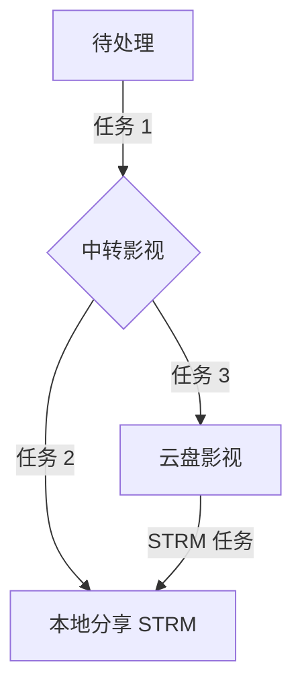

<h1>MediaTidy 项目使用教程</h1>
<blockquote>
<p>基于 CloudDrive2 项目，面向 115 网盘的专注整理工具</p>
</blockquote>

::: tip 推荐阅读
这是一份完整入门手册，适合第一次搭建或从神医 / Emby / STRM 体系迁移到 MediaTidy 的用户。若只想跑通最小链路，也可以先看「新手须知」。
:::
<h2>一、项目简介</h2>
<p>MediaTidy（以下简称 MT）是基于 CloudDrive2（CD2）面向 115 网盘的媒体文件整理工具。其主要特色功能如下：</p>


<table><thead><tr><th>功能</th><th>说明</th></tr></thead><tbody><tr><td><strong>FF缓存服务</strong></td><td>整理时通过服务器或本地缓存读取媒体信息，无需真实访问 115 下载，大幅降低风控和限速风险</td></tr><tr><td><strong>神医JSON缓存服务</strong></td><td>缓存神医 JSON 数据，提升提取效率</td></tr><tr><td><strong>分布式分担</strong></td><td>服务器没有的文件媒体信息，由所有使用该项目的本地用户共同分担 FF 读取任务</td></tr><tr><td><strong>STRM洗版比对</strong></td><td>支持网盘文件和本地分享 STRM 的洗版比对，让入库文件保持唯一最优，同时减少本地存储压力</td></tr></tbody></table>
<h2>二、搭建前的准备</h2>
<h3>2.1 前置条件</h3>
<ol>
<li><strong>CloudDrive2（CD2）</strong>：本项目基于 CD2 访问 115 网盘资源，需提前安装，推荐开通 CD2 会员服务以获得更好体验</li>
<li><strong>MediaTidy 授权</strong>：获取项目授权码</li>
<li><strong>Telesave（可选）</strong>：同作者的项目，作为资源入口使用，需另外获取授权</li>
</ol>
<h3>2.2 路径规划（以飞牛 NAS 为例）</h3>


<table><thead><tr><th>类型</th><th>路径</th></tr></thead><tbody><tr><td>115 网盘</td><td><code>/云盘影视</code>、<code>/待整理</code>、<code>/未识别</code></td></tr><tr><td>本地 STRM 路径</td><td><code>/vol1/1000/strm</code></td></tr><tr><td>本地 Docker 路径</td><td><code>/vol1/1000/docker/mediatidy</code></td></tr></tbody></table>
<h3>2.3 CD2的搭建（以飞牛 NAS 为例）</h3>


```yaml
services:
  cloudnas:
    image: cloudnas/clouddrive2:latest
    container_name: clouddrive2
    ports:
      - 19798:19798
    environment:
      - TZ=Asia/Shanghai
      - CLOUDDRIVE_HOME=/Config
    volumes:
      - ./config:/Config
      - /vol1/1000/CloudNAS:/CloudNAS:shared
      - /vol1/1000/strm:/strm
    devices:
      - /dev/fuse:/dev/fuse
    restart: always
    privileged: true
    network_mode: bridge

```

<p><strong>CD2内的挂载推荐:</strong></p>
<figure class="image-figure"></figure>
<h3>2.4 CD2、MT、emby项目的到映射路径解析</h3>


<table><thead><tr><th>项目</th><th>容器内CD2挂载地址</th><th>容器内媒体库地址</th><th>基准</th></tr></thead><tbody><tr><td>emby</td><td>/CloudNAS</td><td>/strm/云盘影视</td><td>媒体库地址以emby为准</td></tr><tr><td>mediatidy</td><td>/CloudNAS</td><td>/strm/云盘影视</td><td>CD2挂载路径以mt为准</td></tr></tbody></table>
<blockquote>
<p><strong>⚠️ 重要提醒</strong>：如若有差异，比如emby的容器内媒体路径为/帅哥一大家/大帅爸爸/小帅儿子/云盘影视；mt 的容器内媒体库路径为/strm/云盘影视；则需在mt设置项“Emby配置-emby实例-路径映射”里做好映射/strm：/帅哥一大家/大帅爸爸/小帅儿子</p>
</blockquote>
<h2>三、项目搭建与基础设置</h2>
<h3>3.1 Docker Compose 部署（推荐）</h3>
<p>使用 Docker Compose 部署，便于后期维护。以下为飞牛 NAS 的 Compose 配置：</p>


```yaml
services:
  mediatidy:
    image: murongyun574/mediatidy:latest
    container_name: mediatidy
    restart: always
    network_mode: "bridge"
    ports:
      - "2019:2019"      # Web 管理后台端口
      - "8091:8091"      # Emby 302 播放端口
    volumes:
      - ./data:/app/data                                          # 数据持久化
      - /vol1/1000/CloudNAS:/CloudNAS:rshared                     # CD2 FUSE 挂载点
      - /vol1/1000/strm:/strm                                     # 默认 STRM 挂载目录
    environment:
      - TZ=Asia/Shanghai
      - LOG_LEVEL=debug
      - LICENSE_CODE=             # 请填写你的授权码
```

<h3>3.2 首次启动与访问</h3>
<ol>
<li>访问后台：http://&lt;本机IP&gt;:2019</li>
<li>无默认账号密码，首次使用需自行注册</li>
</ol>
<h3>3.3 网盘配置</h3>
<h4>3.3.1 CD2 配置</h4>
<p>进入后台 → 网盘配置 → 添加 CD2 配置。链接方式支持账号密码或 Token 两种方式。<br />
挂载路径为 /CloudNAS/CloudDrive</p>
<figure class="image-figure"></figure>
<h4>3.3.2 115 账号登录</h4>
<p>扫码登录即可。永V用户或不玩分享的用户，推荐使用支付宝/微信小程序接口登录。</p>
<h4>3.3.3 路径映射</h4>
<p>按实际挂载路径和115账号做好映射关系，标签为MT项目文件管理器显示的自定义昵称，可自行修改。</p>
<figure class="image-figure"></figure>
<h4>3.3.4 API 延时（CD2 QPS 策略）</h4>
<p>推荐配置 CD2 的 QPS 策略以优化体验。115 直连用户无需调整此设置。</p>
<figure class="image-figure"></figure>
<h4>3.3.5 云盘目录操作</h4>
<p>根据实际需求配置云盘目录操作行为。</p>
<figure class="image-figure"></figure>
<h3>3.4 Emby 管理</h3>
<ol>
<li>在后台 Emby管理 中添加 Emby 服务器，并生成API token填入</li>
</ol>
<figure class="image-figure"></figure>
<ol start="2">
<li>在 Emby 内 通知地址 填写项目提供的 Webhook 地址<br />
http://&lt;本机IP&gt;:2019/api/webhook/emby</li>
</ol>


<table><thead><tr><th>项目</th><th>状态</th></tr></thead><tbody><tr><td>application/json</td><td>选择</td></tr><tr><td>媒体库/已添加新媒体</td><td>勾选</td></tr><tr><td>神医助手/媒体深度删除</td><td>勾选</td></tr></tbody></table>
<ol start="3">
<li>通知渠道推荐 双 TG 通知渠道，勾选为单独的 Emby 入库通知（不会混杂整理入库和 STRM 生成的通知）</li>
</ol>
<h3>3.5 系统设置</h3>
<h4>3.5.1 Caddy 管理端口</h4>
<p>MediaTidy 服务地址：填写 http://&lt;本机IP&gt;:2019，关系到分享 STRM 的正常工作。</p>
<h4>3.5.2 TMDB 配置</h4>
<p>填写你自己的 TMDB API Key。如果没有请前往 TMDB 官网 申请，使用公共 Key 会影响整理效率。</p>
<h4>3.5.3 媒体后缀</h4>
<ul>
<li>不玩分享的用户：保持默认即可</li>
</ul>
<h4>3.5.4 出站代理</h4>
<p>按需填写，推荐使用 socks5:// 地址。（先保存再测试）</p>
<h4>3.5.5 AI 辅助识别（可选）</h4>
<p>本项目支持调用 AI 对不规范命名进行标题提取。基于 GPT 的辅助识别配置较长，具体请到 TG 群组获取详细配置。</p>
<h4>3.5.6 系统通知</h4>
<p>推荐使用 双 TG 通知：</p>
<ul>
<li>一个用作整理通知，勾选相关管理通知</li>
<li>一个用作入库emby通知，不勾选任何选项，该通知在emby配置里勾选。</li>
</ul>
<figure class="image-figure"></figure>
<p>推荐勾选项请参照官方推荐配置。</p>
<h2>四、规则引擎设置</h2>
<p>MT 的整理、洗版、命名、分类功能均由规则引擎管理，使用 YAML 配置，简洁高效。</p>
<h3>4.1 远程订阅链接</h3>
<p>规则支持从 GitHub 远程加载，本地规则优先级高于远程规则。推荐策略：</p>


<table><thead><tr><th>规则类型</th><th>建议</th><th>远程规则链接</th></tr></thead><tbody><tr><td>命名规则</td><td>本地</td><td>https://raw.githubusercontent.com/MuRongYun8/-/refs/heads/master/naming-rules.yaml</td></tr><tr><td>分类规则</td><td>本地</td><td>https://raw.githubusercontent.com/MuRongYun8/-/refs/heads/master/category-rules</td></tr><tr><td>评分规则</td><td>本地</td><td>https://raw.githubusercontent.com/MuRongYun8/-/refs/heads/master/quality-rules.yaml</td></tr><tr><td>正则替换</td><td>远程</td><td>https://raw.githubusercontent.com/MuRongYun8/-/refs/heads/master/full_rules.yaml</td></tr><tr><td>TMDB覆盖</td><td>远程</td><td>https://raw.githubusercontent.com/MuRongYun8/-/refs/heads/master/tmdb_override</td></tr><tr><td>参数精简</td><td>按需</td><td>https://raw.githubusercontent.com/MuRongYun8/-/refs/heads/master/output_name.yaml</td></tr></tbody></table>
<h3>4.2 命名规则</h3>
<p>命名规则主要有两种类型，一种为ff探测的参数，一种为文件名提取的参数，两者的参数值不一致，有需求自定义需要注意</p>
<ul>
<li>FF探测参数：需配合 FF 开关开启使用</li>
<li>文件名提取参数：需要文件名有此参数才能提取</li>
</ul>
<h4>示例配置</h4>


```yaml
naming:
  - name: k自用-探测混合命名
    id: k-mixed
    movie:
      folder: "{{title}} ({{year}}) {tmdb-{{tmdbid}}}"
      file: "{{title}}.{{year}}.{{probeResolution}}.{{source}}.{{edition}}.{{probeHDR}}.{{probeColorDepth}}.{{probeFrameRate}}.{{probeBitrate}}.{{probeCodec}}.{{probeAudio}}.{{fileExt}}"
    tv:
      folder: "{{title}} ({{year}}) {tmdb-{{tmdbid}}}/Season {{season}}"
      file: "{{title}}.{{year}}.{{seasonEpisode}}.{{probeResolution}}.{{source}}.{{edition}}.{{probeHDR}}.{{probeColorDepth}}.{{probeFrameRate}}.{{probeBitrate}}.{{probeCodec}}.{{probeAudio}}.{{fileExt}}"
```

<h4>命名效果示例</h4>
<p>泰坦尼克号.1997.1080p.BluRay.REMUX.HDR10.10bit.24fps.50Mbps.HEVC.DTS-HDMA.mkv</p>
<p>提示：该命名添加了 REMUX、HDR、色深、帧率、码率等 FF 探测信息。如需自定义，可将参数说明交给 AI 辅助生成，或参照命名模板适配。</p>
<h3>4.3 评分规则（洗版核心）</h3>
<p>评分规则是 MT 洗版功能的核心，通过评分精准控制版本替换。</p>
<ul>
<li><strong>推荐规则</strong>：<code>殊途-杜比优先</code>（建议从 GitHub 复制到本地固定，避免远程更新影响评分结果）。</li>
<li><strong>自定义规则</strong>：可将评分语法说明交给 AI 学习，生成符合需求的规则。</li>
</ul>


```yaml
 - name: 殊途-杜比优先
    id: quality-shutu-dolby
    source_extract_metadata: true
    dest_extract_metadata: true
    scoring:
      resolution:
        enabled: true
        weight: 30
        priority: [2160p, 1080p, 108i, 720p, 480p]

      source:
        enabled: true
        weight: 3
        priority: [Remux+UHD BluRay, Remux+BluRay, Remux+BD, UHD BluRay, BluRay, WEB-DL, WEBRip, WEB, Unknown, HDTV, DVDRip, DVD, CAM]

      video_codec:
        enabled: true
        weight: 8
        priority: [AV1, H.265, H.264, VP9]

      audio_codec:
        enabled: false
        weight: 0
        priority: ["DTS:X", TrueHD Dolby Atmos, DTS-HD MA, Dolby TrueHD, DTS-HD, Dolby Digital Plus Atmos, Dolby Digital Plus, DTS, Dolby Digital, FLAC, AAC, MP3]

      hdr:
        enabled: true
        weight: 30
        priority: [Dolby Vision P7, Dolby Vision P5, Dolby Vision P8, Dolby Vision, HDR10+, HDR10, HLG, HDR, SDR]

      color_depth:
        enabled: false
        weight: 0
        priority: [12-bit, 10-bit, 8-bit]

      frame_rate:
        enabled: false
        weight: 0
        priority: [120fps, 60fps, 30fps, 25fps, 24fps]

      subtitle:
        enabled: false
        weight: 0
        priority: [PGS 简体中文特效, PGS 简体中文, ASS 简中特效, SRT 简体中文, PGS 繁体中文, SRT 繁体中文]

      file_extension:
        enabled: false
        weight: 0
        priority: [mkv, mp4]

      file_size:
        enabled: false
        weight: 0

      bitrate:
        enabled: true
        weight: 20

    exclude:
      resolutions: [360p]
      codecs: [Xvid, DivX]
      hdr_types: []

```

<h4>多版本洗版方案（仅做说明，自行研究）</h4>


<table><thead><tr><th align="left">方案</th><th align="left">实现方式</th><th align="left">说明</th></tr></thead><tbody><tr><td align="left">方案一：维度自动分槽</td><td align="left">按分辨率 + HDR 自动保留多版本</td><td align="left">GitHub 模板：「多版本均衡」</td></tr><tr><td align="left">方案二：显式槽位</td><td align="left">精选 4K DV + 4K HDR + 1080p 三版本</td><td align="left">GitHub 模板：「多版本精选」</td></tr><tr><td align="left">方案三：分类目录隔离</td><td align="left">不同版本分入不同目录（如 <code>Season 1 DV</code> / <code>Season 1 HDR</code>）</td><td align="left">先分类，再在同类内洗版</td></tr></tbody></table>
<h3>4.4 分类规则</h3>
<p>分类规则是迁移用户的重中之重，需要<strong>对齐目录</strong>和<strong>对齐分类</strong>。</p>
<h4>对齐目录</h4>
<ul>
<li><strong>剧集</strong>：对齐到 <code>/剧名 (年份) {tmdb-xxxx}/Season 1</code> 目录（注意 <code>Season 01</code> 与 <code>Season 1</code> 的区别）</li>
<li><strong>电影</strong>：对齐到 strm 所在目录即可</li>
</ul>
<h4>对齐分类</h4>
<ul>
<li><strong>电影分类</strong>：推荐使用 <code>original_language</code>（语种）参数</li>
<li><strong>剧集分类</strong>：推荐使用 <code>origin_country</code>（国家）参数</li>
</ul>
<h4>特殊分类示例（儿童/动漫）</h4>


```yaml
动漫/儿童:
  genre_ids: "10762,-10767,-99,-10764"
    
动漫/儿童:
  ?genre_ids: "&16,10751"
  ?keywords: "数码宝贝"
```

<blockquote>
<p>💡 <code>genre_ids</code> genre_ids这个参数在一个目录内通过或（?）连接，按照实践第二个genre_ids不会命中，如果有此需求，可以如例子进行多目录匹配。</p>
</blockquote>
<p>分类规则推荐：(需按照自己的库进行调整)</p>
<figure class="image-figure"></figure>


```yaml
movie:
  电影/特摄电影:
    genre_ids: "!16"
    ?include_keywords: "tokusatsu,ultraman,kaiju,kamen rider,super sentai,Power Rangers,VR Troopers,Beetleborgs,BIMA,Cicak-Man,Shaktimaan,Darna"
    ?keywords: "tokusatsu,ultraman,奥特曼,超人力霸王,特摄,特攝,假面骑士,假面騎士,铠甲勇士,金甲战士,超级战队,超級戰隊,超神战队,巨神战击队,金光布袋戏,布袋戏,霹雳布袋戏,苦海女神龙,霹雳神州,霹雳英雄,霹雳震寰宇,霹雳天命,云州大儒侠史艳文,Power Rangers,超凡战队,恐龙战队,VR Troopers,Beetleborgs,BIMA,神鹰勇士,Cicak-Man,Shaktimaan,Darna"
    series_keywords: "奥特曼,超人力霸王,假面骑士,铠甲勇士,超级战队,金光布袋戏,霹雳布袋戏"

  电影/R级电影:
    ?keywords: "聊斋艳谭,肉蒲团,蜜桃成熟时,金瓶梅,大内密探之零零性性,聊斋之艳蛇,超淫特攻队,Big波诱惑,玉蒲团,足本玉蒲团,慈禧秘密生活,飞虎出征,现代应召女郎,夜生活女王之霞姐传奇,囡囡"
    ?include_keywords: "eroticism,softcore,sexual fantasy,erotic movie,unusual sexual practices,erotic thriller,erotic drama,erotic horror,erotic animation,pink film,unsimulated sex"

  电影/动画电影:
    genre_ids: "16"

  电影/演唱会:
    genre_ids: "10402,-16"
    keywords: "演唱会,巡演,巡迴,巡回,演出,音乐会,音樂會,音乐剧,音樂劇,交响乐,交響樂,歌剧,歌劇,歌会,歌會,音乐节,音樂節,现场,現場,Live,Concert,Tour,Performance,Show,Stage,MV精选集,特别节目,湾区升明月,日本武道馆,初音未来,魔法未来,Hatsune Miku,少女时代,米津玄师,酒井法子,音乐盛宴"
    series_actors: "周杰伦,林俊杰,王力宏,张韶涵,陈奕迅,张学友,孙燕姿,李宗盛,刘若英,郭富城,谭咏麟,林忆莲,初音未来,米津玄师,少女时代,酒井法子"
    series_keywords: "湾区升明月,中央广播电视总台中秋晚会,维也纳新年音乐会"

  电影/纪录电影:
    genre_ids: "99,-10402,-16"

  电影/华语电影:
    original_language: "zh,cn,bo,za"

  电影/日韩电影:
    ?original_language: "ja,ko"
    ?production_countries: "JP,KR"

  电影/外语电影:


tv:
  电视剧/特摄剧:
    genre_ids: "!16"
    ?include_keywords: "tokusatsu,ultraman,kaiju,kamen rider,super sentai,Power Rangers,VR Troopers,Beetleborgs,BIMA,Cicak-Man,Shaktimaan,Darna"
    ?keywords: "tokusatsu,ultraman,奥特曼,超人力霸王,特摄,特攝,假面骑士,假面騎士,铠甲勇士,金甲战士,超级战队,超級戰隊,超神战队,巨神战击队,金光布袋戏,布袋戏,霹雳布袋戏,苦海女神龙,霹雳神州,霹雳英雄,霹雳震寰宇,霹雳天命,云州大儒侠史艳文,Power Rangers,超凡战队,恐龙战队,VR Troopers,Beetleborgs,BIMA,神鹰勇士,Cicak-Man,Shaktimaan,Darna"
    series_keywords: "奥特曼,超人力霸王,假面骑士,铠甲勇士,超级战队,金光布袋戏,霹雳布袋戏"

  电视剧/综艺:
    genre_ids: "10764,10767"

  电视剧/纪录片:
    genre_ids: "99,-10402,-16"

  动漫/儿童:
    genre_ids: "10762,-10767,-99,-10764"
    keywords: "-数码宝贝,-名侦探柯南,-蜡笔小新,-宝可梦,-哆啦A梦,-龙珠,-海贼王,-火影忍者,-死神"
    series_keywords: "喜羊羊,好奇世界,猫和老鼠,蓝猫淘气三千问,宝宝巴士,熊出没,猪猪侠,海底小纵队,汪汪队立大功"

  动漫/儿童:
    ?genre_ids: "+16,10751"
    ?keywords: "数码宝贝,Digimon"

  动漫/国漫:
    genre_ids: "16,-10762"
    ?origin_country: "CN,TW,HK,MO"
    ?original_language: "zh,cn,bo,za"
    keywords: "-名侦探柯南,-蜡笔小新,-宝可梦,-哆啦A梦"

  动漫/日番:
    genre_ids: "16,-10762"
    ?origin_country: "JP"
    ?original_language: "ja"
    series_keywords: "哆啦A梦,海贼王,火影忍者,名侦探柯南,死神,圣斗士,蜡笔小新,龙珠,宝可梦,鬼灭之刃,福音战士"

  动漫/欧美漫:
    genre_ids: "16,-10762"
    ?origin_country: "US,GB,FR,DE,CA,ES,IT,AU,NZ,-CN,-TW,-HK,-MO,-JP,-KR"
    ?original_language: "en,fr,de,es,it"
    series_keywords: "猫和老鼠,海底小纵队,汪汪队立大功,玩具总动员,小黄人,功夫熊猫"

  电视剧/港台剧:
    ?include_keywords: "TVB"
    ?keywords: "TVB,香港,港剧,港劇,HK,HongKong"
    ?origin_country: "TVB,HK"

  电视剧/国产剧:
    ?origin_country: "CN"
    ?original_language: "zh,cn"

  电视剧/日韩剧:
    ?origin_country: "KR,JP,TH,VN,ID,MY,PH,MM,SG,KH,LA,BN"
    ?original_language: "ko,ja,th,vi,id,ms,tl,my,km,lo"

  电视剧/欧美剧:
    ?origin_country: "US,GB,FR,DE,ES,IT,CA,AU,NZ"
    ?original_language: "en,fr,de,es,it"

  电视剧/未分类: {}


```

<hr />
<h2>五、应用缓存设置</h2>
<h3>5.1 FF 缓存与神医 JSON 服务器</h3>
<p>本项目最大的特色是 FF 缓存服务与神医 JSON 服务器。</p>
<ul>
<li><strong>激活条件</strong>：需预先购买神医 Pro 版。</li>
<li><strong>远程配置节点</strong>：填入官方地址 <code>https://ff.mediatidy.dpdns.org</code></li>
</ul>
<h3>5.2 神医缓存配置</h3>


<table><thead><tr><th align="left">配置项</th><th align="left">推荐设置</th><th align="left">说明</th></tr></thead><tbody><tr><td align="left">手动扫描</td><td align="left">首次使用前建议执行一次</td><td align="left">类似于神医计划任务中的「提取 strm 媒体数据」</td></tr><tr><td align="left">线程并发数</td><td align="left">库内无缺失 JSON：16 线程；否则保持默认</td><td align="left">—</td></tr><tr><td align="left">JSON 存放路径</td><td align="left">必须与本地 strm 目录一致</td><td align="left">如神医设置在其他目录，请改回</td></tr><tr><td align="left">自动整理池</td><td align="left">推荐开启</td><td align="left">神医追更功能，适用于热剧入库</td></tr><tr><td align="left">Emby 神医追更</td><td align="left">需<strong>关闭追更内的媒体提取</strong></td><td align="left">避免与 MT 功能冲突</td></tr><tr><td align="left">片头提取</td><td align="left">MT 暂不支持</td><td align="left">建议使用播放端 App 的片头标记或神医 Emby 的播放行为探测</td></tr><tr><td align="left">定时整理</td><td align="left">按需开启</td><td align="left">相当于神医 Emby 的定时提取计划任务</td></tr></tbody></table>
<figure class="image-figure"></figure>
<figure class="image-figure"></figure>
<hr />
<h2>六、自动整理任务</h2>
<h3>6.1 整理监控</h3>
<ul>
<li><strong>监控机制</strong>：依托 CD2 的 gRPC，<strong>只有通过 CD2 的操作才能被监控</strong>。</li>
<li><strong>入盘文件</strong>：通过其他方式入盘的文件无法被监控，需使用<strong>轮询监控</strong>，推荐间隔 <code>20s ~ 30s</code>。</li>
<li><strong>FF 缓存限制</strong>：整理 FF 只在云盘模式下生效；分享洗版流程中的步骤 1 必须使用云盘模式。</li>
</ul>
<h3>6.2 核心配置建议</h3>


<table><thead><tr><th align="left">配置项</th><th align="left">推荐值</th><th align="left">说明</th></tr></thead><tbody><tr><td align="left">并发数</td><td align="left"><code>1</code>（单线程）</td><td align="left">115 风控日益严格，单线程 + FF 缓存也能日进数百 T</td></tr><tr><td align="left">存储类型</td><td align="left">云盘</td><td align="left">只有这个模式才能使用 FF 缓存</td></tr><tr><td align="left">命名规则</td><td align="left">仅使用 FF 参数相关规则</td><td align="left">自定义重命名需自行适配</td></tr><tr><td align="left">季集强匹配</td><td align="left">开启</td><td align="left">按需开启，建议开启</td></tr><tr><td align="left">评分规则</td><td align="left"><code>殊途-杜比优先</code></td><td align="left">当前最稳定的洗版规则</td></tr><tr><td align="left">元数据</td><td align="left">仅添加字幕</td><td align="left">删除非字幕后缀</td></tr></tbody></table>
<figure class="image-figure"></figure>
<figure class="image-figure"></figure>
<figure class="image-figure"></figure>

<h3>6.3 分享洗版任务</h3>
<p>分享洗版用于把 115 网盘文件与本地分享 STRM 做质量比对，保留每部媒体的唯一最优版本。此流程需要先完成规则配置，并按顺序建立以下四个任务。</p>
<ul>
<li><strong>步骤 1 必须使用云盘模式</strong>，否则整理 FF 无法生效。</li>
<li>如果需要筛选或添加视频后缀，只在步骤 1 处理元数据即可；在系统设置中添加 <code>.strm</code> 后缀也有相同效果。</li>
<li>步骤 2、步骤 3 和查重任务使用本地目录模式，避免重复读取网盘文件。</li>
</ul>

<h4>6.3.1 四个整理任务总览</h4>

| 序号 | 任务名称 |
| ---: | --- |
| 1 | 步骤 1：预处理 ↔ 中转影视 |
| 2 | 步骤 2：中转影视 ↔ 分享 STRM |
| 3 | 步骤 3：中转影视 ↔ 云盘影视 |
| 4 | 查重任务 |

<h4>6.3.2 步骤 1：预处理 ↔ 中转影视</h4>

| 配置项 | 设置 |
| --- | --- |
| 存储类型 | 云盘模式 |
| 移动方式 | 移动 |
| 源目录 | `/预处理/待整理` |
| 目标目录 | `/预处理/中转影视` |
| 并发线程 | 1 线程 |
| 命名规则 | `k自用-探测混合命名` |
| 文件重命名 | 开启 |
| 季集强匹配 | 开启 |
| 洗版设置 | 开启 |
| 评分规则 | `ff单边重命名` |
| FFprobe 提取 | 源目录新文件开启，其余复用关闭 |
| 视频后缀 | 按需控制元数据的参数 |
| 整理后清除 | 开启 |
| 触发方式 | 定期轮询（本地目录），30 秒 |

<h4>6.3.3 步骤 2：中转影视 ↔ 分享 STRM</h4>

| 配置项 | 设置 |
| --- | --- |
| 存储类型 | 本地目录 |
| 移动方式 | **跳过（重要）** |
| 源目录 | CD2 挂载 115 网盘的 `/预处理/中转影视` |
| 目标目录 | MT 映射的本地目录 `/strm/云盘影视` |
| 并发线程 | 1 线程 |
| 命名规则 | `k自用-源信息命名` |
| 文件重命名 | 关闭 |
| 季集强匹配 | 关闭 |
| 洗版设置 | 开启 |
| 评分规则 | `本地strm` |
| FFprobe 提取 | 全部关闭 |
| 视频后缀 | 自定义添加 `.strm`（重要） |
| 整理后清除 | 开启 |
| Emby 媒体库刷新 | 关闭 |
| 触发方式 | 手动执行 |

<h4>6.3.4 步骤 3：中转影视 ↔ 云盘影视</h4>

| 配置项 | 设置 |
| --- | --- |
| 存储类型 | 本地目录 |
| 移动方式 | 移动 |
| 源目录 | CD2 挂载 115 网盘的 `/预处理/中转影视` |
| 目标目录 | CD2 挂载 115 网盘的 `/云盘影视` |
| 并发线程 | 1 线程 |
| 命名规则 | `k自用-源信息命名` |
| 文件重命名 | 关闭 |
| 季集强匹配 | 关闭 |
| 洗版设置 | 开启 |
| 评分规则 | `本地strm` |
| FFprobe 提取 | 全部关闭 |
| 整理后清除 | 开启（重要） |
| 触发方式 | 手动执行 |

<h4>6.3.5 查重任务</h4>

| 配置项 | 设置 |
| --- | --- |
| 存储类型 | 本地目录 |
| 移动方式 | **跳过（重要）** |
| 源目录 | 本地目录 `/strm/云盘影视` |
| 目标目录 | 任意本地空目录 |
| 并发线程 | 4 线程 |
| 命名规则 | `k自用-源信息命名` |
| 最新文件大小 | **0（重要）** |
| 文件重命名 | 关闭 |
| 季集强匹配 | 关闭 |
| 洗版设置 | 开启 |
| 评分规则 | `本地strm` |
| FFprobe 提取 | 全部关闭 |
| 视频后缀 | 自定义添加 `.strm`（重要） |
| 整理后清除 | 开启 |
| Emby 媒体库刷新 | 关闭 |
| 触发方式 | 手动执行 |

<h4>6.3.6 任务组设置</h4>
<p>在步骤 1 任务中依次添加步骤 2 和步骤 3 作为后续任务，即可一键触发完整整理流水线。查重任务按需手动执行。</p>

<h4>6.3.7 整体运行流程</h4>



<ul>
<li><strong>流程目标</strong>：每个入库文件都进行本地洗版比对，保证本地分享 STRM 中只保留唯一最优媒体文件。</li>
<li><strong>跳过模式</strong>：以云盘目录为 A、本地分享 STRM 目录为 B；A 优于 B 时删除 B 中对应的 STRM 和元数据，A 劣于 B 时删除 A 中对应的文件。</li>
</ul>

<hr />
<h2>七、STRM 生成</h2>
<blockquote>
<p>⚠️ 当前版本仅推荐 <strong>115 高速穿透</strong>模式，strm 路径仅推荐 <strong>CD2 本地路径模式</strong>。</p>
</blockquote>
<h3>7.1 字幕与元数据同步</h3>
<ul>
<li><strong>正常流程</strong>：推荐使用<strong>软链接</strong>。</li>
<li><strong>分享洗版流程</strong>：推荐使用<strong>下载</strong>，避免本地分享 STRM 目录依赖软链接。</li>
</ul>
<h3>7.2 输出目录配置</h3>


<table><thead><tr><th align="left">路径类型</th><th align="left">示例</th><th align="left">说明</th></tr></thead><tbody><tr><td align="left">绝对路径</td><td align="left"><code>/strm/云盘影视</code></td><td align="left">对应 compose 中的 <code>/strm</code> 挂载</td></tr><tr><td align="left">相对路径</td><td align="left"><code>strm/云盘影视</code></td><td align="left">实际为 <code>/app/strm/云盘影视</code>，需核对 compose 映射</td></tr></tbody></table>
<p>请根据实际 compose 配置按需更改。</p>
<h3>7.3 清理功能说明</h3>

<ul>
<li><strong>分享洗版流程</strong>：推荐关闭<strong>清理孤立文件</strong>，归档或替换分享目录时再按实际情况手动清理。</li>
</ul>


<table><thead><tr><th align="left">功能</th><th align="center">风险等级</th><th align="left">说明</th></tr></thead><tbody><tr><td align="left">清理脏元数据</td><td align="center">低</td><td align="left">清理本地 strm 目录内无对应 strm 文件的 nfo / jpg 等元数据</td></tr><tr><td align="left">清理孤立文件</td><td align="center">🔴 高</td><td align="left">清理本地多余的 strm 及元数据（与 115 网盘无对应文件时）</td></tr></tbody></table>
<h3>7.4 同步与刷新策略</h3>
<ul>
<li><strong>实时同步</strong>：基于 CD2 gRPC 消息监听，<strong>需 CD2 会员</strong>。</li>
<li><strong>兜底策略</strong>：CD2 gRPC 可能有遗漏，建议<strong>设置定时任务每天执行</strong>。</li>
<li><strong>Emby 媒体库刷新</strong>：
<ul>
<li>MT 与 Emby 的 strm 目录需保持一致（compose 中均为 <code>/strm</code> 则无需额外配置）。</li>
<li>若 MT 为 <code>/app/strm</code>、Emby 为 <code>/strm</code>，需在「Emby 管理」中添加路径映射：<code>/app/strm</code> → <code>/strm</code>。</li>
</ul>
</li>
</ul>
<p>（推荐配置截图如下）</p>
<figure class="image-figure"></figure>
<figure class="image-figure"></figure>
<figure class="image-figure"></figure>

<h2>八、分享 STRM 归档（115 网盘容量达上限时）</h2>
<p>当 115 网盘容量达到上限时，可将现有媒体文件归档为分享链接，释放网盘存储空间。归档前先将“步骤 1：预处理 ↔ 中转影视”改为手动触发。</p>

<h3>归档流程</h3>

| 步骤 | 操作说明 |
| ---: | --- |
| 1 | 先运行一次 STRM 任务，补全缺漏的 STRM 文件。 |
| 2 | 暂时关闭 Emby，将 115 网盘内的 `/网盘影视` 重命名为 `/归档+年份+序号`，例如 `/归档2026-01`，然后生成长期分享链接。 |
| 3 | 等待分享链接正确识别容量后，通过 MT 按原分享账号拉取分享 STRM。 |
| 4 | 将拉取到的分享 STRM 主文件夹重命名，覆盖到本地目录 `/strm/网盘影视`。 |
| 5 | 清除 `/strm/网盘影视` 内所有指向 `/CloudNAS` 的多余本地 STRM 路径。 |
| 6 | 运行本地 STRM 查重任务，配置参考“查重任务”。 |
| 7 | 启动 Emby，建议手动扫描一次媒体库，确认数据同步。 |
| 8 | 确认无误后，再删除 115 网盘 `/网盘影视` 目录内的文件。 |

<p><strong>清除本地分享目录中指向 <code>/CloudNAS</code> 的 STRM：</strong>以下脚本会移动匹配的 STRM 及同名元数据文件，请先备份并按实际目录修改配置。</p>

```python
import shutil
from pathlib import Path

SOURCE_DIR = Path("/vol1/1000/strm/云盘影视")
TARGET_PREFIX = "/CloudNAS"
TARGET_DIR = Path("/vol1/1000/strm/CloudNAS")
FILE_PATTERNS = ["{base}.jpg", "{base}.nfo", "{base}-mediainfo.json"]


def related_files(directory: Path, base: str):
    for pattern in FILE_PATTERNS:
        name = pattern.replace("{base}", base)
        yield from directory.glob(name)


def main():
    if not SOURCE_DIR.is_dir():
        raise SystemExit(f"源目录不存在: {SOURCE_DIR}")

    matched = []
    for strm_file in SOURCE_DIR.rglob("*.strm"):
        try:
            content = strm_file.read_text(encoding="utf-8").strip()
        except OSError as exc:
            print(f"跳过，读取失败: {strm_file}: {exc}")
            continue
        if content.startswith(TARGET_PREFIX):
            matched.append(strm_file)

    for strm_file in matched:
        relative = strm_file.relative_to(SOURCE_DIR)
        destination = TARGET_DIR / relative
        destination.parent.mkdir(parents=True, exist_ok=True)
        shutil.move(str(strm_file), str(destination))

        for companion in related_files(strm_file.parent, strm_file.stem):
            companion_destination = destination.parent / companion.name
            shutil.move(str(companion), str(companion_destination))

    print(f"完成，共移动 {len(matched)} 个 STRM 文件及其关联文件")


if __name__ == "__main__":
    main()
```

<style>
.image-figure {
  margin: 20px 0;
}

.image-figure img {
  display: block;
  max-width: 100%;
  height: auto;
  border: 1px solid var(--vp-c-divider);
  border-radius: 8px;
}

.vp-doc table {
  display: table;
  width: 100%;
}
</style>
