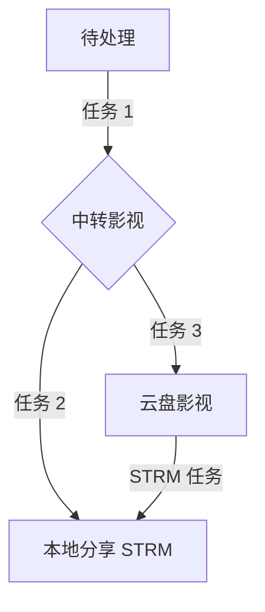

# 分享洗版教程

分享洗版用于将 115 网盘文件与本地分享 STRM 做质量比对，保留每部媒体的唯一最优版本，同时降低本地存储压力。

> 本教程依据《MediaTidy 分享洗版教程 V1.5.2》整理，教程编写时的 MT 版本为 `V0.0.21.M190`。

::: tip 使用前提
请先完成 [MT 入门使用手册](/guide/mt-manual) 中的部署、CD2、115、路径映射、规则和 Emby 配置。本页只介绍分享洗版专用流程。
:::

## 一、开始前的准备

### 目录规划

| 类型 | 路径示例 |
| --- | --- |
| 115 待整理目录 | `/预处理/待整理` |
| 115 中转目录 | `/预处理/中转影视` |
| 115 正式媒体目录 | `/云盘影视` |
| 本地分享 STRM 目录 | `/strm/云盘影视` |

### 关键规则

- 实时监控依赖 CD2 gRPC，只有通过 CD2 执行的目录操作才能被监控。通过其他方式写入网盘的文件需使用轮询监控，建议间隔 20～30 秒。
- 步骤 1 必须使用云盘模式，否则整理 FF 无法生效。
- 步骤 2 和步骤 3 也使用云盘模式；查重任务使用本地目录模式。
- 如果需要筛选视频后缀或处理元数据，只在步骤 1 设置即可。
- 季集强匹配只在步骤 1 按需启用，步骤 2、步骤 3 关闭，确保手动识别后的任务链能继续执行。
- 步骤 1、步骤 2、步骤 3 使用 `k自用-探测混合命名`，查重任务使用 `k自用-源信息命名`；所有任务使用 `本地strm` 评分规则。
- 本地 STRM 开启 FFprobe 前，须通过 CD2 和 MT 的通用挂载接入本地目录，并确保 STRM 内容包含对应文件的 SHA1。

### 命名与评分规则

命名参数分为两类：`probe*` 参数来自 FFprobe 探测，`videoFormat`、`videoCodec` 等参数从文件名提取。分享洗版的三个云盘整理任务需要探测媒体信息，查重任务则直接解析已有 STRM 文件名。

::: warning 保持目录命名一致
示例使用 `{tmdb-xxx}` 目录格式。如果现有媒体库使用 `[tmdbid=xxx]` 或其他格式，请沿用原格式；变更 TMDB 标记样式会影响前后目录对齐。
:::

```yaml
naming:
  - name: k自用-探测混合命名
    id: k-mixed
    movie:
      folder: "{{title}} ({{year}}) {tmdb-{{tmdbid}}}"
      file: "{{title}}.{{year}}.{{probeResolution}}.{{source}}.{{edition}}.{{probeHDR}}.{{probeColorDepth}}.{{probeFrameRate}}.{{probeBitrate}}.{{probeCodec}}.{{probeAudio}}.{{fileExt}}"
    tv:
      folder: "{{title}} ({{year}}) {tmdb-{{tmdbid}}}/Season {{season}}"
      file: "{{title}}.{{year}}.{{seasonEpisode}}.{{probeResolution}}.{{source}}.{{edition}}.{{probeHDR}}.{{probeColorDepth}}.{{probeFrameRate}}.{{probeBitrate}}.{{probeCodec}}.{{probeAudio}}.{{fileExt}}"

  - name: k自用-源信息命名
    id: k-filename
    movie:
      folder: "{{title}} ({{year}}) {tmdb-{{tmdbid}}}"
      file: "{{title}}.{{year}}.{{videoFormat}}.{{source}}.{{edition}}.{{dynamicRange}}.{{colorDepth}}.{{frameRate}}.{{bitrate}}.{{videoCodec}}.{{audioCodec}}.{{fileExt}}"
    tv:
      folder: "{{title}} ({{year}}) {tmdb-{{tmdbid}}}/Season {{season}}"
      file: "{{title}}.{{year}}.{{seasonEpisode}}.{{videoFormat}}.{{source}}.{{edition}}.{{dynamicRange}}.{{colorDepth}}.{{frameRate}}.{{bitrate}}.{{videoCodec}}.{{audioCodec}}.{{fileExt}}"
```

以下是 V1.5.2 教程推荐的 `本地strm` 评分规则。`unknown_policy: zero` 表示信息未知时按 0 分参与比较；字幕按语言分组评分，码率权重为 30：

```yaml
quality:
  - name: 本地strm
    id: quality-strm
    scoring:
      resolution:
        enabled: true
        unknown_policy: zero
        weight: 20
        priority: [2160p, 1080p, 1080i, 720p, 480p]
      video_codec:
        enabled: true
        unknown_policy: zero
        weight: 10
        priority: [H.265, AV1, H.264, VP9]
      hdr:
        enabled: true
        unknown_policy: zero
        weight: 40
        priority: [Dolby Vision P7, Dolby Vision P5, Dolby Vision P8, Dolby Vision, HDR10+, HDR10, HLG, HDR, SDR]
      subtitle:
        enabled: true
        weight: 5
        priority:
          - score: 10.00
            languages: [zh-CN, zh]
            source: any
          - score: 8.00
            languages: [zh-TW, zh-HK, yue]
            source: any
          - score: 8.00
            languages: [und]
            source: any
      bitrate:
        enabled: true
        unknown_policy: zero
        weight: 30
    exclude:
      resolutions: [360p]
      codecs: [Xvid, DivX]
      hdr_types: []
```

## 二、整理任务配置

### 2.1 四个整理任务总览

| 序号 | 任务名称 |
| ---: | --- |
| 1 | 步骤 1：预处理 ↔ 中转影视 |
| 2 | 步骤 2：中转影视 ↔ 分享 STRM |
| 3 | 步骤 3：中转影视 ↔ 云盘影视 |
| 4 | 查重任务 |

### 2.2 步骤 1：预处理 ↔ 中转影视

| 配置项 | 设置 |
| --- | --- |
| 存储类型 | 云盘模式 |
| 移动方式 | 移动 |
| 源目录 | `/预处理/待整理` |
| 目标目录 | `/预处理/中转影视` |
| 并发线程 | 1 线程 |
| 命名规则 | `k自用-探测混合命名` |
| 文件重命名 | 开启 |
| 季集强匹配 | 按需，默认关闭 |
| 洗版设置 | 开启 |
| 评分规则 | `本地strm` |
| 按分类目录选择评分规则 | 关闭 |
| FFprobe 提取 | 源文件探测和目标文件探测开启，其余复用关闭 |
| 视频后缀 | 按需控制元数据的参数 |
| 整理后清除 | 开启 |
| 触发方式 | 定期轮询（本地目录），30 秒 |


### 2.3 步骤 2：中转影视 ↔ 分享 STRM

| 配置项 | 设置 |
| --- | --- |
| 存储类型 | **云盘模式（重要）** |
| 移动方式 | **跳过（重要）** |
| 源目录 | `/预处理/中转影视` |
| 目标目录 | `/strm/云盘影视` |
| 并发线程 | 1 线程 |
| 命名规则 | `k自用-探测混合命名` |
| 文件重命名 | 关闭 |
| 季集强匹配 | 关闭 |
| 洗版设置 | 开启 |
| 评分规则 | `本地strm` |
| FFprobe 提取 | 源文件探测和目标文件探测开启，其余复用关闭 |
| 读取 STRM 内容 | 开启 |
| 视频后缀 | 自定义添加 `.strm`（重要） |
| 整理后清除 | 开启 |
| Emby 媒体库刷新 | 关闭 |
| 触发方式 | 手动执行 |


### 2.4 步骤 3：中转影视 ↔ 云盘影视

| 配置项 | 设置 |
| --- | --- |
| 存储类型 | **云盘模式（重要）** |
| 移动方式 | 移动 |
| 源目录 | `/预处理/中转影视` |
| 目标目录 | `/云盘影视` |
| 并发线程 | 1 线程 |
| 命名规则 | `k自用-探测混合命名` |
| 文件重命名 | 关闭 |
| 季集强匹配 | 关闭 |
| 洗版设置 | 开启 |
| 评分规则 | `本地strm` |
| FFprobe 提取 | 源文件探测和目标文件探测开启，其余复用关闭 |
| 读取 STRM 内容 | 关闭 |
| 整理后清除 | 开启（重要） |
| 触发方式 | 手动执行 |


### 2.5 查重任务

| 配置项 | 设置 |
| --- | --- |
| 存储类型 | 本地目录 |
| 移动方式 | **跳过（重要）** |
| 源目录 | 本地目录 `/strm/云盘影视` |
| 目标目录 | 任意本地空目录 |
| 并发线程 | 4 线程 |
| 命名规则 | `k自用-源信息命名` |
| 最新文件大小 | **0（重要）** |
| 文件重命名 | 关闭 |
| 季集强匹配 | 关闭 |
| 洗版设置 | 开启 |
| 评分规则 | `本地strm` |
| FFprobe 提取 | 全部关闭 |
| 视频后缀 | 自定义添加 `.strm`（重要） |
| 整理后清除 | 开启 |
| Emby 媒体库刷新 | 关闭 |
| 触发方式 | 手动执行 |


### 2.6 任务组设置

在步骤 1 任务中依次添加步骤 2 和步骤 3 作为后续任务，即可一键触发完整整理流水线。查重任务按需手动执行。

### 2.7 整体运行流程


```mermaid
flowchart TD
  A[待处理] -->|任务 1| B{中转影视}
  B -->|任务 2| C[本地分享 STRM]
  B -->|任务 3| D[云盘影视]
  D -->|STRM 任务| C
```

- 流程目标：每个入库文件都进行本地洗版比对，保证本地分享 STRM 中只保留唯一最优媒体文件。
- 跳过模式：以云盘目录为 A、本地分享 STRM 目录为 B；A 优于 B 时删除 B 中对应的 STRM 和元数据，A 劣于 B 时删除 A 中对应的文件。

## 三、STRM 配置

::: warning 推荐模式
当前版本仅推荐使用 **115 高速穿透**模式，STRM 路径仅推荐使用 **CD2 本地路径**模式。
:::

### 3.1 字幕与元数据同步

分享洗版流程推荐使用**下载**，避免本地分享 STRM 目录依赖软链接。

### 3.2 输出目录

| 路径类型 | 示例 | 说明 |
| --- | --- | --- |
| 绝对路径 | `/strm/云盘影视` | 对应 compose 中的 `/strm` 挂载 |
| 相对路径 | `strm/云盘影视` | 实际为 `/app/strm/云盘影视`，需核对 compose 映射 |

### 3.3 清理策略

分享洗版流程推荐关闭**清理孤立文件**，归档或替换分享目录时再按实际情况手动清理。

| 功能 | 风险等级 | 说明 |
| --- | --- | --- |
| 清理脏元数据 | 低 | 清理本地 STRM 目录内无对应 STRM 文件的 nfo、jpg 等元数据 |
| 清理孤立文件 | 高 | 清理本地多余的 STRM 及元数据，可能误删分享目录文件 |

### 3.4 同步与刷新

- 实时同步基于 CD2 gRPC 消息监听，需要 CD2 会员。
- CD2 gRPC 可能有遗漏，建议每天设置一次定时任务作为兜底。
- MT 与 Emby 的 STRM 目录应保持一致；如果 MT 为 `/app/strm`、Emby 为 `/strm`，需在 Emby 管理中添加路径映射 `/app/strm` → `/strm`。

## 四、分享 STRM 归档

当 115 网盘容量达到上限时，可将现有媒体文件归档为分享链接，释放网盘存储空间。归档前先将“步骤 1：预处理 ↔ 中转影视”改为手动触发。

### 4.1 归档流程

| 步骤 | 操作说明 |
| ---: | --- |
| 1 | 先运行一次 STRM 任务，补全缺漏的 STRM 文件。 |
| 2 | 暂时关闭 Emby，将 115 网盘内的 `/网盘影视` 重命名为 `/归档+年份+序号`，例如 `/归档2026-01`，然后生成长期分享链接。 |
| 3 | 等待分享链接正确识别容量后，通过 MT 按原分享账号拉取分享 STRM。 |
| 4 | 将拉取到的分享 STRM 主文件夹重命名，覆盖到本地目录 `/strm/网盘影视`。 |
| 5 | 清除 `/strm/网盘影视` 内所有指向 `/CloudNAS` 的多余本地 STRM 路径。 |
| 6 | 运行本地 STRM 查重任务，配置参考“查重任务”。 |
| 7 | 启动 Emby，建议手动扫描一次媒体库，确认数据同步。 |
| 8 | 确认无误后，再删除 115 网盘 `/网盘影视` 目录内的文件。 |

### 4.2 清理多余本地 STRM

以下脚本会移动内容以 `/CloudNAS` 开头的 STRM 及同名元数据文件。执行前请先备份，并按实际目录修改配置。

```python
import shutil
from pathlib import Path

SOURCE_DIR = Path("/vol1/1000/strm/云盘影视")
TARGET_PREFIX = "/CloudNAS"
TARGET_DIR = Path("/vol1/1000/strm/CloudNAS")
FILE_PATTERNS = ["{base}.jpg", "{base}.nfo", "{base}-mediainfo.json"]


def related_files(directory: Path, base: str):
    for pattern in FILE_PATTERNS:
        name = pattern.replace("{base}", base)
        yield from directory.glob(name)


def main():
    if not SOURCE_DIR.is_dir():
        raise SystemExit(f"源目录不存在: {SOURCE_DIR}")

    matched = []
    for strm_file in SOURCE_DIR.rglob("*.strm"):
        try:
            content = strm_file.read_text(encoding="utf-8").strip()
        except OSError as exc:
            print(f"跳过，读取失败: {strm_file}: {exc}")
            continue
        if content.startswith(TARGET_PREFIX):
            matched.append(strm_file)

    for strm_file in matched:
        relative = strm_file.relative_to(SOURCE_DIR)
        destination = TARGET_DIR / relative
        destination.parent.mkdir(parents=True, exist_ok=True)
        shutil.move(str(strm_file), str(destination))

        for companion in related_files(strm_file.parent, strm_file.stem):
            companion_destination = destination.parent / companion.name
            shutil.move(str(companion), str(companion_destination))

    print(f"完成，共移动 {len(matched)} 个 STRM 文件及其关联文件")


if __name__ == "__main__":
    main()
```
